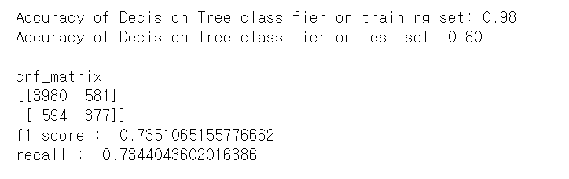
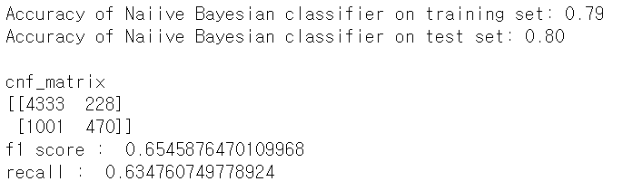
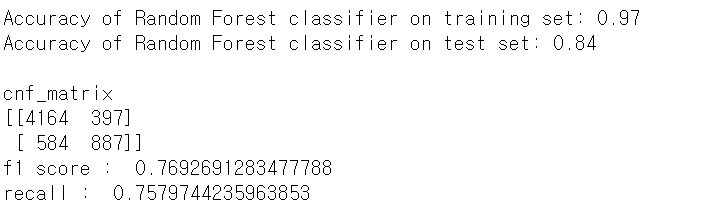
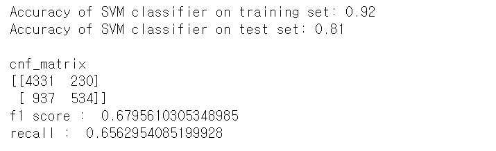
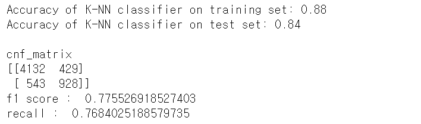
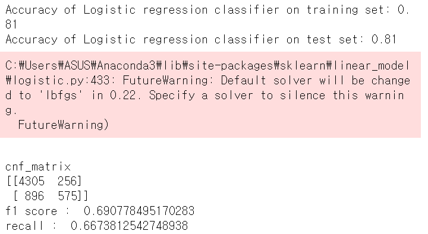
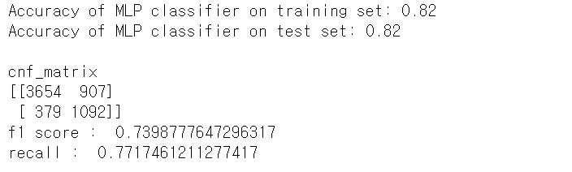

# census_income-data-analysis-machine-learning

## Contents
* About Project
* Motivation
* Algorithm
* Result
* Tech/framework used

&nbsp;

## About Project
data analysis on census income data using machine learning techniques such as decision tree, naiive bayesian, random forest, svm, knn, logistic regression and deep neural network.

First of all, conducted EDA on census income data.

Then applied each models describe above to the data.

&nbsp;

## Motivation
School machine learning class Project

&nbsp;

## Algorithm
Used data from [census income](
http://archive.ics.uci.edu/ml/datasets/Census+Income)

It shows whether salary would be more than 50K dollor depending on such attributes. There are total 48842 instances in the dataset.

**Attribute Information**
age(나이) : continuous
workclass (노동계급)  : Private(일반 사기업), Self-emp-not-inc (자영업이 아닌 법인), Self-emp-inc (자영업자 통합), Federal-gov (연방정부 소속), Local-gov (지방정부 소속), State-gov (주정부 소속), Without-pay (무급), Never-worked (일 경험 없음).  
fnlwgt (final weight / 최종 몸무게): continuous.
education(교육) : Bachelors (학사), Some-college (대학 자퇴), 11th (고 2 자퇴), HS-grad (고졸), Prof-school(전문 대학교), Assoc-acdm (2년제 대학 졸), Assoc-voc (직업 전문 대학), 9th (중 3 자퇴), 7th-8th (중학교 자퇴), 12th(고3 자퇴), Masters (석사), 1st-4th (초 자퇴), 10th (고 1 자퇴), Doctorate (박사 ), 5th-6th (초 5-6 자퇴), Preschool (유치원).
education-num(총 교육 받은 기간) : continuous.
marital-status(결혼 상태) : Married-civ-spouse (결혼), Divorced (이혼), Never-married (미혼), Separated (별거), Widowed (미망인), Married-spouse-absent (결혼 상대 부재), Married-AF-spouse (married- armed forces spouse, 군인과 결혼).
occupation (직업): Tech-support (기술직), Craft-repair (기능직), Other-service (다른 서비스직), Sales (세일즈), Exec-managerial (관리직), Prof-specialty (전문직), Handlers-cleaners (청소직), Machine-op-inspct (기계 관리직), Adm-clerical (사무직), Farming-fishing (임야업), Transport-moving (수송업), Priv-house-serv (가사도우미), Protective-serv (보안), Armed-Forces(군인).
relationship(관계): Wife (부인), Own-child(자식), Husband(남편), Not-in-family (가족 소속 안되어 있음), Other-relative (사촌), Unmarried(미혼).
race(인종): White(백인), Asian-Pac-Islander(동양인 및 태평양 출신), Amer-Indian-Eskimo(인디안 혹은 에스키모), Other (그 외), Black(흑인).
sex(성별): Female(여자), Male(남자).
capital-gain(주 소득 외 수익): continuous.
capital-loss(주 소득 외 손실): continuous.
hours-per-week(주 일하는 시간): continuous.
native-country(출신 국가): United-States, Cambodia, England, Puerto-Rico, Canada, Germany, Outlying-US(Guam-USVI-etc), India, Japan, Greece, South, China, Cuba, Iran, Honduras, Philippines, Italy, Poland, Jamaica, Vietnam, Mexico, Portugal, Ireland, France, Dominican-Republic, Laos, Ecuador, Taiwan, Haiti, Columbia, Hungary, Guatemala, Nicaragua, Scotland, Thailand, Yugoslavia, El-Salvador, Trinadad&Tobago, Peru, Hong, Holand-Netherlands.

**Algorithms**

Applied alogrithms listed below. After training with these models, compared training data and valid data to see whether there is overfitting.

1. Decision tree data
2. Naiive Bayes Bayes' theorm
3. Random Forest
4. SVM (Support Vector Machine)
5. Nearest Neighbors Classifier
6. Logistic Regression logistic function
7. MLP (Multi-layer Perceptron) Neural network Perceptron
8. Deep Learning deep neural network

&nbsp;

## Results
**1. Decision tree data**

&nbsp;

**2. Naiive Bayes Bayes' theorm**

&nbsp;

**3. Random Forest**

&nbsp;

**4. SVM (Support Vector Machine)**

&nbsp;

**5. Nearest Neighbors Classifier**

&nbsp;

**6. Logistic Regression logistic function**

&nbsp;

**7. MLP (Multi-layer Perceptron) Neural network Perceptron**

&nbsp;

**8. Deep Learning deep neural network**

accuracy : 0.8049
validatio : 0.8014

## Tech/framework used
<b>Built with</b>
- python
- pandas
- numpy
- sklearn
- keras - matplotlib
&nbsp;
